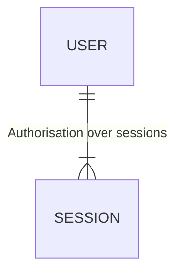

## Creds for test

[admin](https://#): `test`

## DB



## CI/CD

[Admin panel](https://#): password are stored inside github secret

```bash
# Environments and secrets

# application admin password
APP_ADMIN_PASSWORD

# web application params
APP_BUBBLES_DB_USER
APP_BUBBLES_DB_PASSWORD
APP_BUBBLES_PROD_ADMIN_PASSWORD
APP_BUBBLES_SECRET_KEY
APP_BUBBLES_SENTRY_DSN

# deploy params
APP_BUBBLES_PROD_SSH_HOST
APP_BUBBLES_PROD_SSH_USER
APP_BUBBLES_PROD_SSH_KEY

REDIS_URL

DB_USER
DB_PASSWORD


```

## CLI

Command line interface driven by [nest stand alone app](https://docs.nestjs.com/standalone-applications) and [nest-commander](https://nest-commander.jaymcdoniel.dev/docs/).

Commands stored in `commands` folder.

Run `npm run build` before cli execution. It should be compiled firstly.

```bask
# show commands list
$ yarn app:bubbles:cli -- -h
$ npm run app:bubbles:cli -- -h

# run a command
$ yarn app:bubbles:cli some-command-name
$ npm run app:bubbles:cli some-command-name
```

## Installation

It is a monorepo. So it is composed out of several applications with shared libraries. All of them separated in workspaces. So it is possible to specify which workspace should be installed.

```bash
$ yarn workspace bubbles install
```

## DB Migrations

Migrations [docs](https://typeorm.io/migrations)

```bash
# generate migrations
$ npm run typeorm:migration:generate

# run and apply migrations
$ npm run typeorm:migration:run

# rollback migrations
$ npm run typeorm:migration:revert
```

## DB Fixtures

Fixtures powered by [typeorm-fixtures](https://github.com/RobinCK/typeorm-fixtures) and [faker.js](https://github.com/faker-js/faker)

```bash
# apply fixtures
$ yarn workspace afla fixtures
```

## Running the app

```bash
# development in watch mode
$ yarn app:bubbles:dev

# build 
$ yarn app:bubbles:build

# run prod 
$ yarn app:bubbles:prod
```

## Test

```bash
# unit tests
$ yarn test

# e2e tests
$ yarn test:e2e

# test coverage
$ yarn test:cov
```
