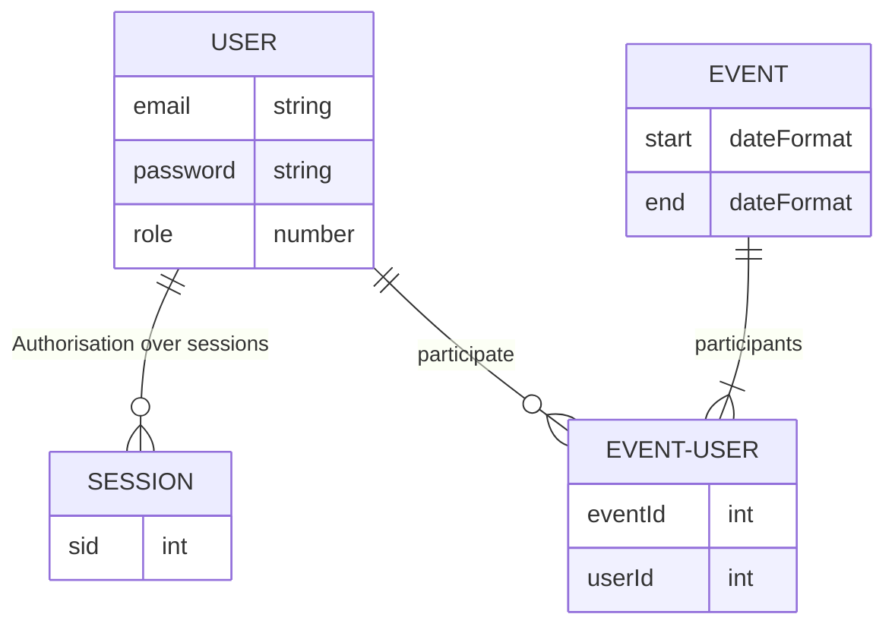

## Swarm

Application build to run with orchestrator.
The most simple way is to use docker swarm.
For this we will need at least two hosts to run our nodes on them.
And to allow communication between them secure network should be provided.
It could be done either by hosting all nodes in one local network,
or by creating VPN to work as an overlay network.
Such as wireguard. Since it was included in linux kernel after 5.6 version,
this seems to be a good way to do it.

So docker swarm + wireguard probably is a best way to selfhost it.

### Wireguard config:

Server:
```
[Interface]
Address = 10.8.8.1/24
SaveConfig = true
PostUp = ufw route allow in on %i out on eth0
PostUp = iptables -t nat -I POSTROUTING -o eth0 -j MASQUERADE
PreDown = ufw route delete allow in on %i out on eth0
PreDown = iptables -t nat -D POSTROUTING -o eth0 -j MASQUERADE
ListenPort = 51820
PrivateKey = <server private key>

[Peer]
PublicKey = <client public key>
AllowedIPs = 10.8.8.2/32

[Peer]
PublicKey = <client public key>
AllowedIPs = 10.8.8.3/32
```

Client:
```
[Interface]
Address = 10.8.8.2/24
PrivateKey = <client private key>

[Peer]
PublicKey = <server public key>
# Wireguard server endpoint to connect
Endpoint = 66.66.666.666:51820
AllowedIPs = 10.8.8.0/24
```

### Docker swarm

Open ports for specific interface (name it `wg` for example) on which wireguard running:
```bash
## Should be opened on manager node
sudo ufw allow in on swarm to any port 2377 proto tcp

## Should be opened on every node
sudo ufw allow in on wg to any port 7946 proto tcp
sudo ufw allow in on wg to any port 7946 proto udp
sudo ufw allow in on wg to any port 4789 proto udp
```

On manager node initiate swarm and create overlay network accessible from every node.
```bash
## initiate and tell to swarm from where manager node is accesible
docker swarm init --advertise-addr=10.8.8.2

## now create overlay network to which services from different nodes can attache themself
docker network create -d overlay --attachable swarm-overlay-network
```

Now join other workers or managers nodes. Remember to advertise to swarm an address from which they can be accessible:
```bash
docker swarm join --advertise-addr 10.8.8.3 --token <swarm token provide after its initiation> 10.8.8.2:2377
```

Now deploy the stack with and have fun:
```bash
## --prune to clean old services not mentioned in stack,
## -d to detach
## -c to specify configuration file with stack services description
docker stack deploy --prune -d -c stack-configuration.yml
```

## Creds for test

[admin](https://#): `test`

## DB


```mermaid
erDiagram
    USER {
        email string
        password string
        role number
    }
    EVENT {
        start dateFormat
        end dateFormat
    }
    EVENT-USER {
        eventId int
        userId int
    }
    SESSION {
        sid int
    }
    USER 1--0+ SESSION : "Authorisation over sessions"
    USER 1--0+ EVENT-USER : "participate"
    EVENT 1--1+ EVENT-USER : "participants"
```

## CI/CD

[Admin panel](https://#): password are stored inside github secret

```bash
# Environments and secrets

# application admin password
APP_ADMIN_PASSWORD

# web application params
APP_BUBBLES_DB_USER
APP_BUBBLES_DB_PASSWORD
APP_BUBBLES_PROD_ADMIN_PASSWORD
APP_BUBBLES_SECRET_KEY
APP_BUBBLES_SENTRY_DSN

# deploy params
APP_BUBBLES_PROD_SSH_HOST
APP_BUBBLES_PROD_SSH_USER
APP_BUBBLES_PROD_SSH_KEY

REDIS_URL

DB_USER
DB_PASSWORD


```

## CLI

Command line interface driven by [nest stand alone app](https://docs.nestjs.com/standalone-applications) and [nest-commander](https://nest-commander.jaymcdoniel.dev/docs/).

Commands stored in `commands` folder.

Run `npm run build` before cli execution. It should be compiled firstly.

```bask
# show commands list
$ yarn app:bubbles:cli -- -h
$ npm run app:bubbles:cli -- -h

# run a command
$ yarn app:bubbles:cli some-command-name
$ npm run app:bubbles:cli some-command-name
```

## Installation

It is a monorepo. So it is composed out of several applications with shared libraries. All of them separated in workspaces. So it is possible to specify which workspace should be installed.

```bash
$ yarn workspace bubbles install
```

## DB Migrations

Migrations [docs](https://typeorm.io/migrations)

```bash
# generate migrations
$ npm run typeorm:migration:generate

# run and apply migrations
$ npm run typeorm:migration:run

# rollback migrations
$ npm run typeorm:migration:revert
```

## DB Fixtures

Fixtures powered by [typeorm-fixtures](https://github.com/RobinCK/typeorm-fixtures) and [faker.js](https://github.com/faker-js/faker)

```bash
# apply fixtures
$ yarn workspace afla fixtures
```

## Running the app

```bash
# development in watch mode
$ yarn app:bubbles:dev

# build 
$ yarn app:bubbles:build

# run prod 
$ yarn app:bubbles:prod
```

## Test

```bash
# unit tests
$ yarn test

# e2e tests
$ yarn test:e2e

# test coverage
$ yarn test:cov
```
